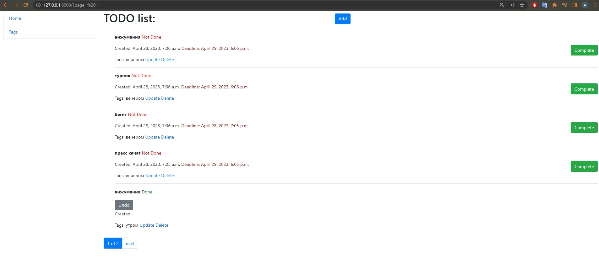

# ToDo List

The "ToDo List" project is a web application built with Django that enables
you to create and manage tasks. Using the site, you can mark tasks as 
completed or undone, view their deadlines and creation dates,
and categorize them using tags.

You have the ability to create, update, and delete tasks and tags as needed, making this project a simple yet effective alternative to popular task management tools.
## Check it out!

[TODO deployed to Render](https://to-do-list-yv6c.onrender.com/)


## Installation

1. Copy this repository, by using your terminal:
```git
git clone https://github.com/Oleksiy-Liubchenko/todo-list.git
```
2. Change directory to main project folder. Use this command:
```git
cd todo-list
```
3. Install venv, and activate it by using following commands:
```git
python3 -m venv myvenv
```
to activate on Windows:
```git
myvenv\Scripts\activate
```
to activate on Unix or Linux:
```git
source myvenv/bin/activate
```
4. Install dependencies (requirements):
```git
pip install -r requirements.txt
```
5. Run migrations to initialize database. Use this command:
```git
python manage.py migrate
```
6. Run the server of app
```git
python manage.py runserver
```
Inside the main folder, there is a file called .env_sample which contains
an example of the SECRET_KEY needed for the project. To proceed, you
should create a new file called .env and enter your own secret key following
the example provided.
7. The time has come! Now use it :)

## Usage
This site is free for all - you don't need to create any account or login.

This site is pretty much easy to use - after running it, you'll be on the main page (tasks list), from which you can switch to tags page and vice versa. Then you can just follow the buttons and links.

## Contributing

If you want to help improve the project, please fork the repository and create a new branch specifically
for the feature or change you want to make. When you're done, submit a pull request, so I can review
your changes and merge them into the main repository. I would be happy to accept your contributions!


## Demo

